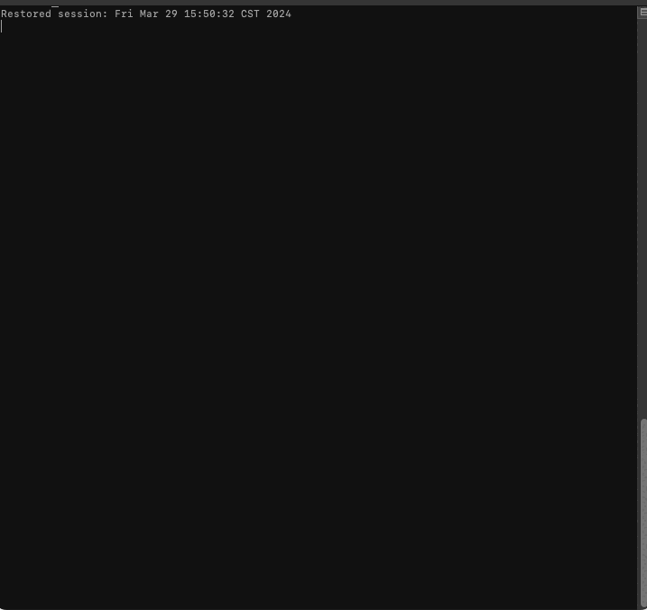

## donut.js 
### a 3d rendering script of a donut(torus) that works in your terminal.

this script generates a 3d render of a torus using ascii chracters in your terminal.  
### Demo
  
**visual artefacting is caused by recording and converting to gif via the terminal.  
**this artefacting should not happen when executing the script.
### Usage
1. Make sure you have a js runtime environment like nodejs
2. Clone this repo
3. Navigate to the directory where the script is located via the terminal '`cd ..`' 
4. Finally run the code using '`node donut.js`'

### Modifing the parameters in the script
You can modify the following parameters in the script:
+ `theta_spacing` -> Angular spacing between points in the torus.
+ `phi_spacing` -> Angular spacing between circles in the torus.
+ `R1`, `R2`, `K1`, `K2` -> Shape and rendering of the torus.
+ `screen_width`, `screen_height` -> Dimensions of the rendering area.
+ `maxFrames`, `frameDelay` -> Parameters to controll the animation.

### Debugging
If you're having issues, try making the terminal window bigger or change the parameters in the script.

### Credits
I have adapted the c code from [here](https://www.a1k0n.net/2011/07/20/donut-math.html); to be able to run in your terminal with js. In the original website I noticed that the original creator had only done it on the web(with js) and in the terminal(with c). He hadn't done it in the terminal with js, so I thought it would be fun challenge to try to convert his c code into js to run in the terminal. It ended up turning out alright. It could use some improvements but its 3am and I need sleep 😅. I welcome you to try to improve/modify/maybe optimize this code to your hearts content. If you do please make a pull request and I would love to see what you do with it.   
  
For deeper understanding of how this code works I invite you to visit his page, he explains how it works very nicely.

